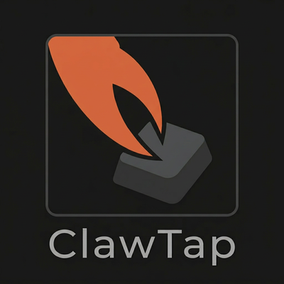

<div align="center">




**Wireless keyboard bridge — type on any computer from your phone or AI assistant**

[](https://pypi.org/project/clawtap-mcp/)
[](LICENSE)

</div>

---

A tiny two-chip device that receives text over Bluetooth and types it as a real USB keyboard. Works with Claude, any MCP-compatible AI, or any BLE app on your phone.

```
Phone / AI  →  BLE  →  ESP32  →  UART  →  RP2040  →  USB HID  →  💻
```

## Quick Start

```bash
claude mcp add clawtap -- uvx clawtap-mcp
```

Or install manually:

```bash
pip install clawtap-mcp
```

## Hardware

Three components, three wires, zero soldering skills required.

| Component | Role | ~Price |
|-----------|------|:------:|
| ESP32-WROOM-32 | 2.4 GHz wireless receiver | $4 |
| Waveshare RP2040-Zero | USB HID keyboard controller | $3 |
| 3× DuPont wires | Connection | — |

### Wiring

```
ESP32              RP2040-Zero
─────              ───────────
GPIO17 (TX) ─────► GP1 (RX)
GND ─────────────► GND
VIN ◄──────────── 5V (VBUS)
```

Plug RP2040-Zero into the target computer via USB-C. ESP32 is powered from RP2040's 5V.

### Firmware

Firmware source: [`clawtap-firmware`](https://github.com/list91/clawtap-firmware)

<details>
<summary><b>ESP32 — wireless receiver</b></summary>

```bash
arduino-cli core install esp32:esp32
arduino-cli compile --fqbn esp32:esp32:esp32 firmware/esp32-ble-receiver/
arduino-cli upload  --fqbn esp32:esp32:esp32 --port COMx firmware/esp32-ble-receiver/
```

Advertises as **"ClawTap"** over BLE (Nordic UART Service).

</details>

<details>
<summary><b>RP2040-Zero — USB keyboard</b></summary>

```bash
arduino-cli core install rp2040:rp2040 \
  --additional-urls https://github.com/earlephilhower/arduino-pico/releases/download/global/package_rp2040_index.json
arduino-cli compile --fqbn rp2040:rp2040:waveshare_rp2040_zero firmware/rp2040-hid-keyboard/
```

Flash: hold **BOOT**, plug USB-C, copy `.uf2` to the `RPI-RP2` drive.

</details>

## MCP Tools

| Tool | What it does |
|------|-------------|
| `type_text(text)` | Type text as keystrokes. Supports ASCII + Cyrillic |
| `press_key(key, count)` | Press a special key: `enter`, `escape`, `backspace`, `f1`–`f12`, arrows |
| `combo_keys(keys)` | Key combo up to 5 keys: `["ctrl","c"]`, `["alt","tab"]`, `["win","r"]` |
| `health_check()` | Check wireless connection and device status |

### Examples

```python
# Type text
type_text("Hello World!\n")

# Cyrillic (target must have RU layout active)
type_text("Привет мир")

# Key combos
combo_keys(["ctrl", "c"])      # Copy
combo_keys(["alt", "tab"])     # Switch window
combo_keys(["win", "r"])       # Run dialog

# Special keys
press_key("backspace", 5)      # Delete 5 chars
press_key("enter")
```

## Troubleshooting

| Problem | Fix |
|---------|-----|
| Device not found | Power cycle ESP32. Make sure no other app is connected to it |
| Wrong characters | Check keyboard layout on target computer (EN for English, RU for Cyrillic) |
| Disconnects | Stay within 10m. Check USB power stability |

## License

MIT

---

<div align="center">
<sub>Formerly <a href="https://pypi.org/project/ghosttype-mcp/">ghosttype-mcp</a></sub>
</div>
